# 🚀 India Runs Hackathon: AI Candidate Ranking System

An advanced talent intelligence system designed for candidate retrieval, analysis, and ranking. This solution operates in two primary modes: a live **Recruiter Copilot Web App** powered by Gemini and Supabase, and a fully reproducible, **Offline Ranking Pipeline** optimized for constrained CPU environments.

---

## 🏗 System Architecture

The codebase leverages a shared data model and scoring algorithm, optimized for both real-time recruiter interaction and batch CPU processing.

```mermaid
graph TD
    subgraph "Mode 1 — Recruiter Copilot (Web App)"
        JD[Raw Job Description] -->|FastAPI| API(Backend API)
        API --> JD_Parser(Job Intelligence Engine)
        JD_Parser -->|Gemini 2.5 Flash| StructuredJD[Structured JD JSON]
        StructuredJD --> Embedder(Semantic Embedder)
        Embedder -->|Gemini Embedding-2| Vector["3072-dim Vector"]
        Vector --> Supabase(Supabase pgvector)
        Supabase -->|Top 25 Cosine Similarity| Pool[Candidate Pool]
        Pool --> RankEngine(Ranking Engine)
        RankEngine --> Copilot(Recruiter Copilot)
        Copilot --> RiskEngine[Risk Analysis]
        Copilot --> Comparison[Side-by-Side Compare]
        Copilot --> InterviewGuide[AI Interview Guide]
    end

    subgraph "Mode 2 — Offline Ranking Submission"
        JSONL[candidates.jsonl] --> RankPy(rank.py)
        RankPy -->|all-MiniLM-L6-v2 local| Embeddings[Batch Embeddings CPU]
        Embeddings --> Signals(Multi-Signal Scorer)
        Signals --> HoneypotDetect[Honeypot Detector]
        Signals --> ConsultingPenalty[Consulting Penalty]
        Signals --> AvailScorer[Availability Scorer]
        HoneypotDetect --> FinalScore[Final Composite Score]
        ConsultingPenalty --> FinalScore
        AvailScorer --> FinalScore
        FinalScore --> CSV[submission.csv — top 100]
    end
```



---

## 🧠 Key Design Decisions

### 1. Dual-Mode Architecture: Web Copilot vs. Offline Batch
* **The Challenge**: The Recruiter Copilot Web App requires deep, real-time contextual analysis (Gemini) for interviews and risk evaluation. The hackathon offline ranking pipeline must run in under 5 minutes on CPU with zero network access.
* **The Solution**: We created two separate pathways running on the same underlying schema:
  - **Mode 1 (Copilot)**: Cloud-native (Gemini 2.5 Flash + `gemini-embedding-2` + Supabase pgvector) for live recruiter interaction.
  - **Mode 2 (Offline)**: Fully local CPU pipeline (`all-MiniLM-L6-v2` via `sentence-transformers`) for high-speed offline batch ranking.

### 2. Two-Stage Offline Retrieval Pipeline
* **The Challenge**: Encoding 100,000 candidate profiles with transformers on CPU exceeds the 5-minute hackathon time limit (~75 minutes).
* **The Solution**: A multi-stage retrieval flow:
  - **Stage 1 (Deterministic Fast Pass)**: Parses all candidates and ranks them based on structured indicators (skills, experience, availability). Takes ~10 seconds.
  - **Stage 2 (Semantic Deep Dive)**: Selects the top 3,000 candidates and runs CPU-based embedding matches on them to find the perfect job fit. The entire process takes **~2.8 minutes**.

### 3. Multi-Signal Scoring System
Rather than relying purely on cosine similarity, we apply structural corrections to candidate profiles:

| Signal | Weight | Purpose / Detection |
| :--- | :---: | :--- |
| **Semantic Similarity** | 40% | Core profile alignment to Job Description |
| **Skill Match** | 35% | Intersection of required (Python, VectorDBs, NLP) and nice-to-have skills |
| **Experience Fit** | 25% | Experience matches target range, domain relevance, and seniority |
| **Honeypot Penalty** | Multiplier | Detects and penalizes fake/impossible profiles |
| **Consulting Penalty** | Multiplier | Automatically down-weights candidate profiles with 100% consulting backgrounds |
| **Availability Multiplier** | Multiplier | Down-weights unresponsive profiles or long notice periods |

---

## 🛠 Core Features

### 1. Job Intelligence Engine
* **Structured JDs**: Instantly normalizes unstructured text descriptions into strongly-typed schemas using LLMs.
* **Constraint Extraction**: Automatically extracts hard requirements (e.g., location, minimum experience) and filters candidates.

### 2. Offline Hybrid Ranking (`rank.py`)
* Completely CPU-bound, offline script.
* Performs full-text normalization, applies honeypot detection, calculates consulting penalties, and formats candidate scores.

### 3. Live Recruiter Copilot
* **Side-by-Side Candidates Comparison**: AI-driven matrix highlighting comparative strengths and match values.
* **Risk Analyzer**: Flags job-hopping tendencies, gaps in employment, and title regressions.
* **AI Interview Guide**: Generates custom technical questions tailored to the candidate's missing skills and background.

---

## 🚦 Getting Started

### Mode A: Reproduce Offline Ranking (Hackathon Submission)

The offline pipeline satisfies all resource and time constraints (runs in ~2.8 minutes on CPU, uses ~150MB RAM).

#### 1. Running Locally (Python)
```bash
# Install dependencies
pip install -r requirements-rank.txt

# Cache the semantic model locally
python cache_model.py

# Run ranking to generate submission
python rank.py --candidates ./candidates.jsonl --out ./submission.csv

# Validate the output format
python data/validate_submission.py submission.csv
```

#### 2. Running via Docker
```bash
# Build the Docker image (pre-caches model inside image)
docker build -f Dockerfile.rank -t india-runs-ranker .

# Run container to generate submission.csv
# On Linux / macOS:
docker run --rm -v "$(pwd)":/data india-runs-ranker --candidates /data/candidates.jsonl --out /data/submission.csv

# On Windows PowerShell:
docker run --rm -v "${PWD}:/data" india-runs-ranker --candidates /data/candidates.jsonl --out /data/submission.csv
```

---

### Mode B: Recruiter Copilot Web App 💻

#### 1. Setup Environment
Rename `.env.example` to `.env` and fill in your keys:
```env
SUPABASE_URL=https://your-project.supabase.co
SUPABASE_KEY=your_anon_key
GEMINI_API_KEY=your_gemini_key
```

#### 2. Database Migration & Seeding
Execute [setup.sql](file:///c:/Users/jyoti/Desktop/IndiaRunsBE/backend/db/setup.sql) in your Supabase SQL Editor, then run the seed script:
```bash
python backend/db/seed.py
```

#### 3. Run the Application
```bash
# Terminal 1: Backend API
uvicorn backend.app.main:app --reload

# Terminal 2: Frontend App
cd frontend
npm run dev
```

* API Docs: `http://localhost:8000/docs`
* Web Dashboard: `http://localhost:3000`

---

## 📄 Submission Format

Output matches the required CSV schema: `candidate_id,rank,score,reasoning`

Example output:
```csv
candidate_id,rank,score,reasoning
CAND_0000031,1,1.0000,Recommendation Systems Engineer with 6.0 yrs; 4 AI core skills; response rate 0.91
CAND_0000001,2,0.9690,Backend Engineer with 6.9 yrs; 5 AI core skills; response rate 0.34
...
```